# TECHNO STUDY - Agile Yazılım Test Projesi -
## Akakce TR Sprint

* **1 HAFTALIK SPRINT** 
* **Environment:** Akakçe Web Sitesi (https://www.akakce.com/) 

1. >> Kullanacağımız environment, canlı bir site olduğu için, lütfen
   sprint sonunda oluşturduğunuz kullanıcıları sistemden silin.
2. >> Bu task için locator stratejisi olarak sadece XPATH ve CSS
   kullanın… 🚨🚨🚨 ID ve name kullanmıyoruz ! 🛑🛑🛑
3. >> Cookie’leri onaylamanız veya reddetmeniz programın çalışmasını
   etkilemeyecek. O yüzden “Accept Cookies” ‘i görmezden gelelim...
   
# User Stories

## US_101 Kullanıcı Hesabı Oluşturma
### Bir kullanıcı olarak, Akakce.com sitesinde hesap oluşturabilmeliyim. Böylece kendime özel bir alışveriş deneyimi yaşamış olurum.
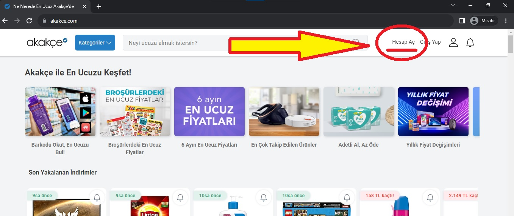 
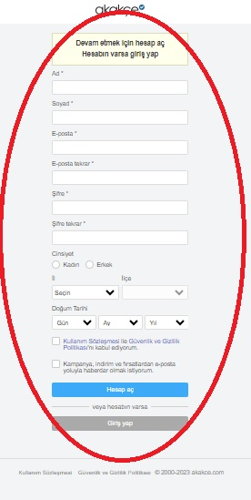 
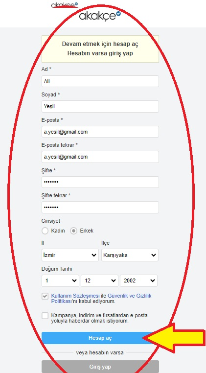
### Kabul Kriterleri:
1. Kullanıcı adı, soyadı, e-posta, şifre, cinsiyet, doğum tarihi gibi bilgileri girerek hesap oluşturabilmelidir.
2. Doğru bilgiler girilerek hesap oluşturulduğunda, hesap doğrulama sayfasına yönlendirilir.

### Önkoşullar:
- Test için kullanılacak tarayıcı (Chrome, Safari veya Firefox) yüklü ve başlatılmış durumda olmalıdır.
- Test ortamında internet erişimi sağlanmalıdır.
- Geçerli şifre en az 8 karakterli olmalı; büyük-küçük harf ve rakam içermelidir.

---

## US_102 Hesap Doğrulama Kontrolü
### Bir kullanıcı olarak, sisteme başarılı bir şekilde login olduğumda, sağ üst köşedeki profil kısmında ismini görebilmeliyim. Böylece daha güvenli bir alışveriş deneyimi yaşarım.
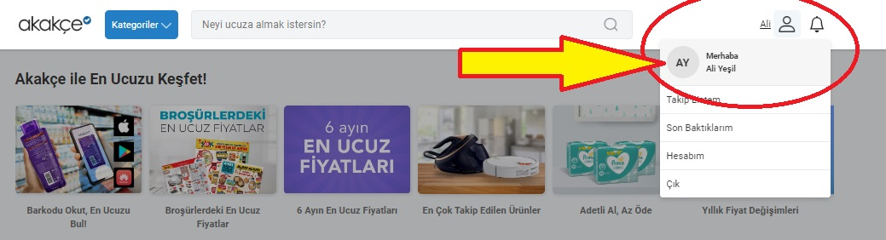
### Kabul Kriterleri:
1. Kullanıcı geçerli giriş bilgilerini girerek başarılı bir şekilde sisteme giriş yaptığında, adı sayfanın sağ üst köşesindeki profil bölümünde görülmelidir.
2. Görüntülenen ad, hesap oluşturma sürecinde sağlanan ad ile tam olarak eşleşmelidir.

### Önkoşullar:
- Kullanıcının başarıyla bir hesap oluşturmuş olması gerekir.

---

## US_103 Oturumu Kapatma (Logout)
### Bir kullanıcı olarak, Akakce.com sitesindeki hesabımdan çıkış yapabilmeliyim. Böylece alışverişim daha güvenli olur.

### Kabul Kriterleri:
1. Kullanıcı hesaptan çıkış yapabilmelidir.
2. Kullanıcı oturumu başarıyla kapattığı zaman giriş yapma sayfasına yönlendirilmelidir.
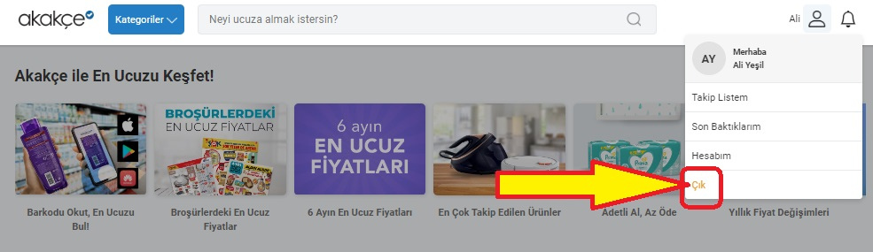
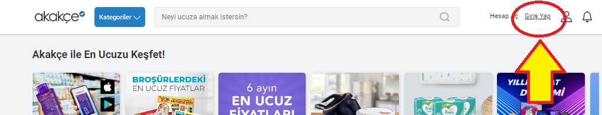
### Önkoşullar:
- Kullanıcı web sitesine giriş yapmış durumda olmalıdır.

---

## US_104 Oturum Açma (Login)
### Bir kullanıcı olarak, Akakce.com sitesine giriş yapabilmeliyim. Böylece, kendimle ilgili tercihleri sisteme tekrar tekrar girmek zorunda kalmamış olurum.
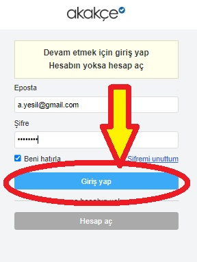
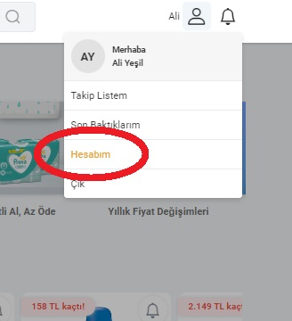
### Kabul Kriterleri:
1. Kullanıcı verileri doğru olduğu zaman, giriş işlemi başarılı olmalı ve kullanıcı sisteme giriş yapabilmelidir.

### Önkoşullar:
- Kullanıcının hesabı (Kullanıcının e-posta adresi ve Kullanıcının şifresi) başarılı bir şekilde oluşturulmuş ve doğrulanmış olmalıdır.

---

## US_105 Sipariş Listesi Kontrolü
### Bir kullanıcı olarak, hesabıma giriş yaparak sipariş listesini kontrol edebilmeliyim. Böylece kontrol dışı alışveriş yapmamış olurum.

### Kabul Kriterleri:
1. Kullanıcı, hesabına giriş yapar ve sipariş listesine yönlendirilir.
2. Sipariş listesi boşsa, uygun bir mesaj görüntülenir.
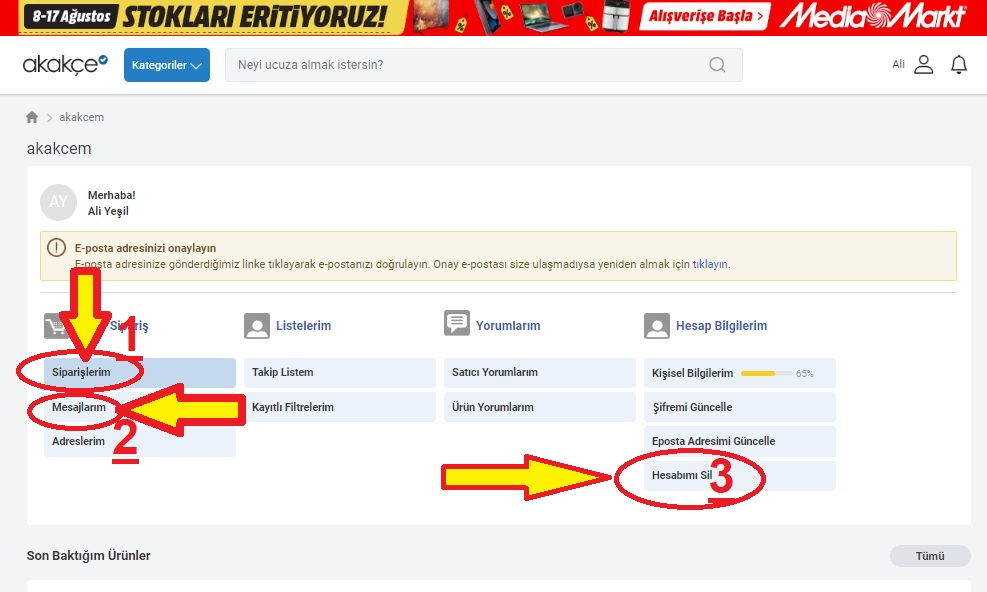
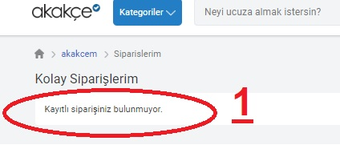
### Önkoşullar:
- Kullanıcının hesabı (Kullanıcının e-posta adresi ve Kullanıcının şifresi) başarılı bir şekilde oluşturulmuş ve doğrulanmış olmalıdır.
- Sipariş listesi kontrolü için sisteme login olunmalıdır.

---

## US_106 Mesaj Kutusu Kontrolü
### Bir kullanıcı olarak, hesabıma giriş yaparak mesaj kutusunu kontrol edebilmeliyim. Böylece, bana özel kampanya ve bildirimleri kaçırmamış olurum.
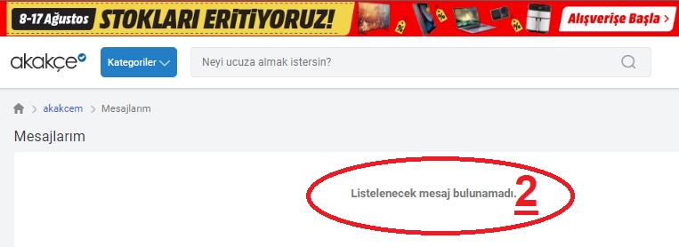
### Kabul Kriterleri:
1. Kullanıcı, hesabına giriş yapar ve mesaj kutusuna yönlendirilir.
2. Mesaj kutusu boşsa, uygun bir mesaj görüntülenir.

### Önkoşullar:
- Kullanıcının hesabı (Kullanıcının e-posta adresi ve Kullanıcının şifresi) başarılı bir şekilde oluşturulmuş ve doğrulanmış olmalıdır.
- Mesaj kontrolü için sisteme login olunmalıdır.

---

## US_107 Hesap Silme
### Bir kullanıcı olarak, kendi hesabımı silebilmeliyim. Böylece kişisel verilerimin korunduğundan emin olabilirim.
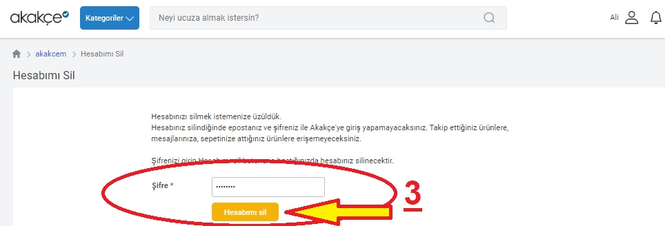
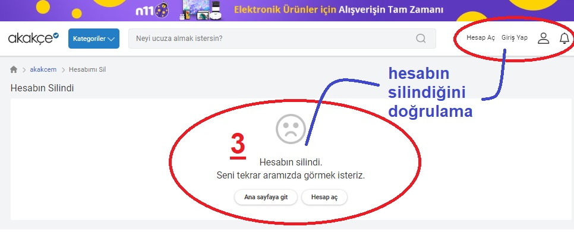
### Kabul Kriterleri:
1. Kullanıcı, hesabına giriş yaptığı zaman, kendi hesabını sistemden silebilmelidir.
2. Hesap silme işlemi sırasında doğru şifre girildiğinde, hesap başarılı bir şekilde silinebilmelidir.

### Önkoşullar:
- Kullanıcının hesabı (Kullanıcının e-posta adresi ve Kullanıcının şifresi) başarılı bir şekilde oluşturulmuş ve doğrulanmış olmalıdır.
- Hesap silme işlemi, silinecek hesaba login olmadan gerçekleştirilemez.
